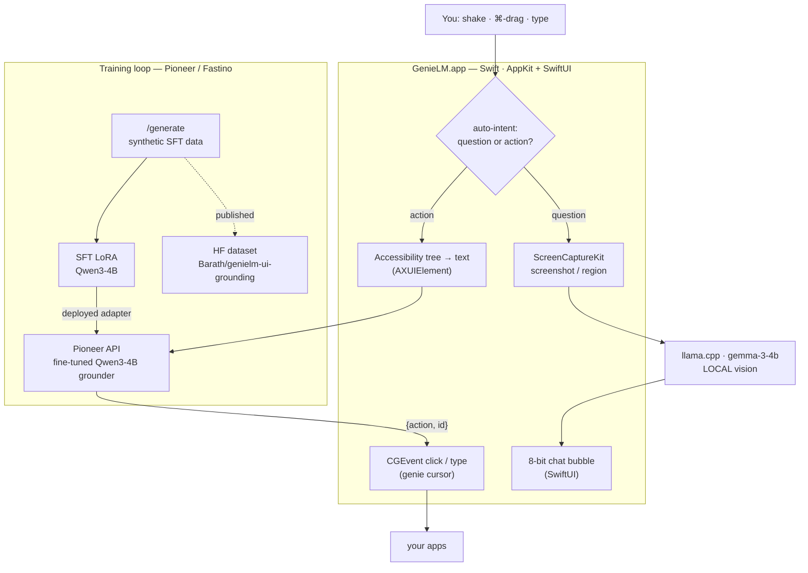

# GenieLM 👁

A native macOS menu-bar agent that lets a **local Gemma vision model** see your
screen. Shake your mouse (or ⌘-drag a region) and a retro 8-bit chat bubble
floats next to your cursor so you can ask about whatever's on screen. No cloud,
no API keys - runs fully on-device via llama.cpp.

Hackathon project (Pioneer / Fastino Labs). Built native in Swift.

## What it does

- **Shake to chat** - shake the mouse → it screenshots the whole screen and a
  chat bubble pops up at your cursor. Ask anything; follow-ups keep context.
- **⌘ + drag to snip** - hold ⌘ and drag a rectangle anywhere → that region is
  captured, shown as a thumbnail in the chat, and sent to the model.
- **Genie cursor** - type `tic tac toe` in the chat to play tic-tac-toe against
  a "genie" pointer: you draw your X, Gemma *looks at the board* and the genie
  hand-draws its O. (Menu also has a standalone trailing genie cursor.)
- **8-bit theme** - neon-green CRT styling, the bundled *Press Start 2P* arcade
  font, and synthesized chiptune blips on every action.

## Controls

| Action | Trigger |
|--------|---------|
| Open chat (full screen) | **Shake** the mouse, or menu → *Open chat now* |
| Snip a region | **Hold ⌘ and drag** a rectangle, then release |
| Ask / follow up | Type in the `>` field, press **Return** |
| Play tic-tac-toe | Type `tic tac toe` in the chat |
| Toggle genie cursor | Menu → *Toggle genie cursor* (⌘G) |
| Close | **Shake** again, or **Esc** |

## Architecture

The core idea: **vision runs locally (Gemma), the action brain is a model fine-tuned on Pioneer**, and the screen is grounded as **text** (the accessibility tree) rather than pixels.



## Requirements

- macOS 14+ (built/tested on macOS 27, Apple Silicon)
- [llama.cpp](https://github.com/ggml-org/llama.cpp) (`llama-server`) serving a Gemma 3 GGUF + mmproj (vision):
  ```bash
  brew install llama.cpp
  hf download ggml-org/gemma-3-4b-it-GGUF \
      gemma-3-4b-it-Q4_K_M.gguf mmproj-model-f16.gguf --local-dir models/gemma3
  llama-server -m models/gemma3/gemma-3-4b-it-Q4_K_M.gguf \
      --mmproj models/gemma3/mmproj-model-f16.gguf --port 8080 -ngl 99 --jinja
  ```
  (Override the URL with `LLAMA_URL`. Online action-grounding uses Pioneer; set
  `PIONEER_API_KEY` + `MODEL`/`PIONEER_MODEL`, else it falls back to local Gemma.)

## Build & run

```bash
./build.sh
open GenieLM.app
```

A 👁 icon appears in the menu bar.

### First-run permissions

macOS prompts for **Screen Recording** the first time it captures
(System Settings → Privacy & Security → Screen Recording → enable GenieLM,
then relaunch). Mouse observation needs no special permission.

For live logs during a demo, run the binary directly instead of `open`:
```bash
./GenieLM.app/Contents/MacOS/GenieLM
```

## How it works

| Piece | File | Notes |
|-------|------|-------|
| Shake gesture | `ShakeDetector.swift` | Global `NSEvent` monitor; rapid horizontal direction reversals (ignored while ⌘ is held) |
| ⌘-drag snip | `CmdDragSnipper.swift` | Passive global mouse monitors + a click-through overlay that draws the selection box |
| Screen grab | `ScreenCapture.swift` | ScreenCaptureKit full-display capture, then crops per-`NSScreen` (multi-monitor safe) |
| Vision model | `LlamaClient.swift` | OpenAI-compatible calls to local `llama-server` (vision via mmproj) |
| Chat bubble | `OverlayController.swift` | SwiftUI in a non-activating `NSPanel`; follows the cursor, bouncy spring, sizes to content |
| Genie cursor | `GenieCursor.swift` | Click-through neon arrow that follows / glides / traces strokes |
| Tic-tac-toe | `DrawGame.swift` | Freehand board; Gemma reads a screenshot and returns the move as `x,y` coords |
| Sound | `RetroSound.swift` | Square-wave chiptune blips synthesized in memory |
| Wiring | `main.swift` | Menu-bar agent (`LSUIElement`), triggers, capture → chat |

## Tuning

- **Shake sensitivity** - `ShakeDetector.swift`: `reversalsToTrigger`,
  `windowSeconds`, `minSpeed`, `cooldown`.
- **Board image** - drop any grid image at `Resources/board.png` (it's recolored
  to neon on load) and rebuild.
- **Model** - swap the GGUF passed to `llama-server` (any multimodal model).
